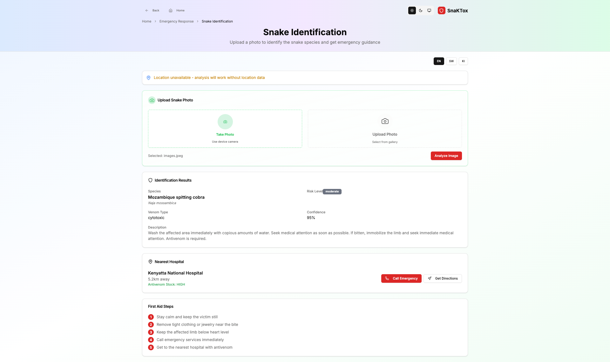

# SnaKTox - AI-Powered Snakebite Emergency Response System

[](https://github.com/mauriceosoro/snaktox/actions)
[](https://github.com/mauriceosoro/snaktox/actions)
[]
[]

## 🐍 Project Overview

SnaKTox is a comprehensive, AI-powered platform dedicated to snakebite awareness, prevention, and emergency response. Built with verified medical data from WHO, CDC, and KEMRI, it bridges the gap between field responders, hospitals, and the public through a unified, secure system.

### Mission
To save lives by combining verified medical data, artificial intelligence, and community education to reduce snakebite mortality and disability in Sub-Saharan Africa.

### Key Features
- 🏥 **Hospital Network**: Verified treatment centers with real-time antivenom availability
- 🚨 **Emergency SOS**: GPS-based emergency reporting with nearest hospital routing
- 🤖 **AI Detection**: Snake species recognition and first-aid chatbot
- 📚 **Education Portal**: WHO/CDC-verified awareness and prevention content
- 📊 **Analytics Dashboard**: Data-driven insights for policymakers and researchers

## 🏗️ Architecture

### Tech Stack
- **Frontend**: Next.js 14 + Tailwind CSS + ShadCN/UI
- **Backend**: NestJS + Prisma ORM + MongoDB
- **AI Service**: Python FastAPI + Machine Learning models
- **Mobile**: Flutter (Phase 4)
- **Infrastructure**: Docker + GitHub Actions CI/CD

### Monorepo Structure
```
snaktox/
├── apps/
│   ├── web/              # Next.js frontend
│   ├── backend/          # NestJS backend API
│   └── mobile/           # Flutter app (Phase 4)
├── services/
│   └── ai-service/       # Python FastAPI ML service
├── prisma/
│   ├── schema.prisma     # Database schema
│   └── seed/             # Verified seed data
├── docs/
│   ├── architecture/     # System documentation
│   └── changelogs/       # Version history
└── .github/workflows/    # CI/CD pipelines
```

## 📱 Screenshots

### Homepage - Light Theme


### Homepage - Dark Theme


### AI Snake Detection


### Emergency Response


### Hospitals Directory


### Education Portal


---

## 🚀 Quick Start

### Prerequisites
- Node.js 18+ and npm 8+
- Docker and Docker Compose
- MongoDB 7+ (MongoDB Atlas or local instance)

### Development Setup

1. **Clone the repository**
   ```bash
   git clone https://github.com/mauriceosoro/snaktox.git
   cd snaktox
   ```

2. **Install dependencies**
   ```bash
   npm install
   ```

3. **Setup environment variables**
   ```bash
   cp .env.example .env
   # Edit .env with your configuration
   ```

4. **Start development environment**
   ```bash
   docker-compose up -d
   ```

5. **Run database migrations**
   ```bash
   npm run db:push
   npm run db:seed
   ```

6. **Start development servers**
   ```bash
   npm run dev
   ```

### Access Points
- **Web App**: http://localhost:3000
- **API**: http://localhost:3001
- **API Docs**: http://localhost:3001/api/docs
- **AI Service**: http://localhost:8000

## 📊 Database Schema

### Core Entities
- **SnakeSpecies**: Verified snake data from WHO/KEMRI
- **Hospital**: Treatment centers with antivenom stock
- **SOSReport**: Emergency incident reports
- **EducationMaterial**: WHO/CDC-verified content
- **AnalyticsLog**: System metrics and usage data

### Data Sources
All data is sourced from verified medical authorities:
- World Health Organization (WHO)
- Centers for Disease Control and Prevention (CDC)
- Kenya Medical Research Institute (KEMRI)
- Ministry of Health (Kenya)

## 🔐 Security & Compliance

### Data Protection
- AES-256 encryption for sensitive data
- GDPR/HIPAA-aligned anonymization
- Role-based access control (RBAC)
- JWT + OAuth2 authentication

### Security Measures
- Automated secret scanning (TruffleHog)
- Docker security scanning (Trivy)
- Input validation and sanitization
- Rate limiting and CORS protection

## 🧪 Testing

### Test Coverage
- Unit tests: Jest + Supertest
- Integration tests: API endpoint testing
- E2E tests: Playwright (Phase 3)
- Coverage requirement: ≥85%

### Running Tests
```bash
# Unit tests
npm run test

# Integration tests
npm run test:e2e

# Coverage report
npm run test:cov
```

## 🚀 Deployment

### CI/CD Pipeline
- **Lint & Test**: ESLint, Prettier, Jest
- **Security Scan**: TruffleHog, npm audit, Snyk
- **Build & Test**: Docker image build and security scan
- **Deploy**: Automated deployment to Render/Railway

### Environment Variables
Required environment variables are documented in `.env.example`. Never commit actual secrets to version control.

## 📚 Documentation

- [Architecture Blueprint](blueprint.md)
- [API Documentation](http://localhost:3001/api/docs)
- [Database Schema](prisma/schema.prisma)
- [Deployment Guide](docs/deployment.md)

## 🤝 Contributing

### Development Workflow
1. Fork the repository
2. Create a feature branch
3. Follow the coding standards
4. Write tests for new features
5. Submit a pull request

### Code Standards
- ESLint + Prettier configuration
- TypeScript strict mode
- Comprehensive test coverage
- Security-first development

## 📞 Support

### Emergency Contacts
- **Kenyatta National Hospital**: +254-20-2726300
- **Moi Teaching and Referral Hospital**: +254-53-2033471
- **Coast General Hospital**: +254-41-2312191

### Technical Support
- **Issues**: [GitHub Issues](https://github.com/mauriceosoro/snaktox/issues)
- **Discussions**: [GitHub Discussions](https://github.com/mauriceosoro/snaktox/discussions)
- **Email**: support@snaktox.org

## 📄 License

This project is licensed under the MIT License - see the [LICENSE](LICENSE) file for details.

## 🙏 Acknowledgments

- **World Health Organization** for global snakebite data and guidelines
- **Centers for Disease Control and Prevention** for medical protocols
- **Kenya Medical Research Institute** for local species data
- **Ministry of Health Kenya** for hospital verification
- **Open Source Community** for the amazing tools and libraries

---

**⚠️ Medical Disclaimer**: This system provides information for educational purposes only. Always seek immediate medical attention for snakebites. The AI detection and chatbot features are supplementary tools and should not replace professional medical advice.

**🔒 Data Privacy**: All personal and medical data is handled according to Kenya Data Protection Act (2019) and international privacy standards.

---

## 📄 License

This project is licensed under the MIT License - see the [LICENSE](LICENSE) file for details.

**Copyright (c) 2025 Maurice Osoro and the SnaKTox team for public health and safety.**

---

© 2025 SnaKTox. All rights reserved. Medical data verified by WHO, CDC, and KEMRI.


[def]: https://opensource.org/licenses/MIT