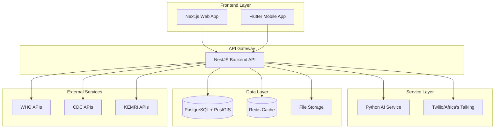
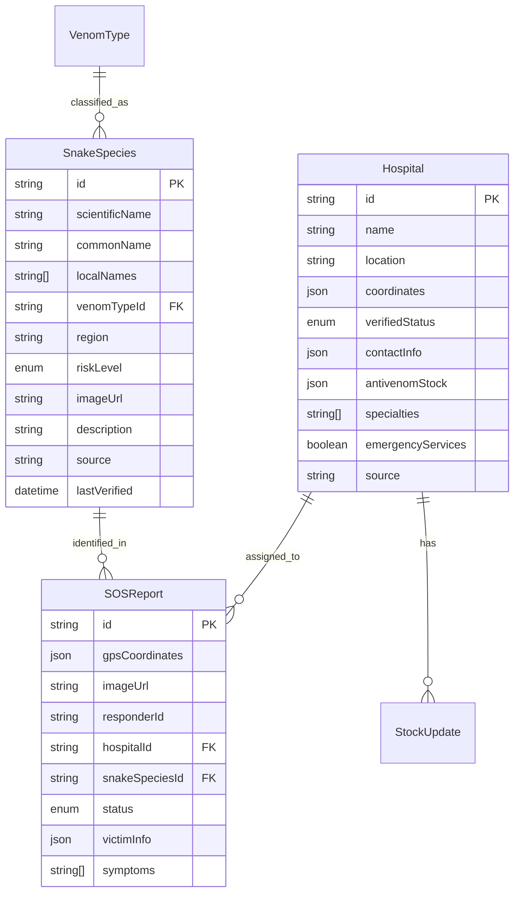

# SnaKTox Architecture Documentation

## Overview

SnaKTox is built as a modular, scalable system following DevSecOps principles and scientific accuracy standards. The architecture ensures data integrity, security compliance, and maintainability while serving the critical public health mission of snakebite emergency response.

## System Architecture

### High-Level Architecture

## Technology Stack

### Frontend
- **Next.js 14**: React framework with SSR/SSG capabilities
- **Tailwind CSS**: Utility-first CSS framework
- **ShadCN/UI**: Component library for consistent design
- **TypeScript**: Type-safe development

### Backend
- **NestJS**: Scalable Node.js framework
- **Prisma ORM**: Type-safe database access
- **PostgreSQL**: Primary database with PostGIS extension
- **Redis**: Caching and session storage
- **Winston**: Structured logging

### AI Service
- **Python FastAPI**: High-performance API framework
- **TensorFlow/PyTorch**: Machine learning models
- **OpenCV**: Image processing
- **scikit-learn**: Additional ML utilities

### Infrastructure
- **Docker**: Containerization
- **GitHub Actions**: CI/CD pipeline
- **Render/Railway**: Cloud deployment
- **Prometheus + Grafana**: Monitoring (Phase 3)

## Database Design

### Core Entities

#### SnakeSpecies
- Stores verified snake data from WHO/KEMRI
- Includes scientific names, local names, venom types
- Risk level classification and habitat information
- Source attribution and verification dates

#### Hospital
- Verified treatment centers with antivenom capabilities
- GPS coordinates for geospatial queries
- Contact information and operating hours
- Antivenom stock tracking

#### SOSReport
- Emergency incident reports from field responders
- GPS coordinates and image uploads
- Victim information (anonymized)
- Hospital assignment and status tracking

#### EducationMaterial
- WHO/CDC-verified educational content
- Multi-language support
- Categorized by prevention, first aid, treatment
- Source attribution and verification

### Data Relationships

## Security Architecture

### Authentication & Authorization
- **JWT Tokens**: Stateless authentication
- **Role-Based Access Control**: Public, Hospital, Admin roles
- **OAuth2**: Integration with external providers
- **Rate Limiting**: API protection against abuse

### Data Protection
- **AES-256 Encryption**: Sensitive data encryption
- **Data Anonymization**: Patient information protection
- **GDPR Compliance**: Privacy regulation adherence
- **Audit Trails**: All actions logged and tracked

### Infrastructure Security
- **HTTPS/TLS**: All communications encrypted
- **Helmet.js**: Security headers
- **CORS**: Cross-origin request protection
- **Input Validation**: Comprehensive data sanitization

## API Design

### RESTful Endpoints

#### Hospitals
- `GET /api/v1/hospitals` - List all hospitals
- `GET /api/v1/hospitals/nearby` - Find nearby hospitals
- `GET /api/v1/hospitals/:id` - Get hospital details
- `POST /api/v1/hospitals` - Create new hospital (Admin)

#### SOS Reports
- `POST /api/v1/sos` - Create emergency report
- `GET /api/v1/sos/:id` - Get report details
- `PATCH /api/v1/sos/:id` - Update report status

#### Education
- `GET /api/v1/education` - List educational materials
- `GET /api/v1/education/:id` - Get specific material
- `GET /api/v1/education/category/:category` - Filter by category

#### AI Services
- `POST /api/v1/ai/detect` - Snake species detection
- `POST /api/v1/ai/chat` - First aid chatbot

### API Standards
- **OpenAPI 3.0**: Comprehensive API documentation
- **HTTP Status Codes**: Standard REST responses
- **Error Handling**: Consistent error format
- **Pagination**: Large dataset handling
- **Filtering**: Query parameter filtering

## Deployment Architecture

### Development Environment
- **Docker Compose**: Local development setup
- **Hot Reload**: Development server auto-restart
- **Database Seeding**: Verified test data
- **Mock Services**: External API simulation

### Production Environment
- **Container Orchestration**: Docker containers
- **Load Balancing**: Multiple instance support
- **Database Clustering**: High availability
- **CDN**: Static asset delivery
- **Monitoring**: Health checks and metrics

### CI/CD Pipeline
- **Source Control**: Git with branch protection
- **Automated Testing**: Unit, integration, and E2E tests
- **Security Scanning**: Dependency and secret scanning
- **Build Automation**: Docker image creation
- **Deployment**: Automated staging and production

## Data Flow

### Emergency Response Flow
1. **Incident Report**: Field responder creates SOS report
2. **AI Analysis**: Snake species detection from image
3. **Hospital Matching**: Find nearest hospital with antivenom
4. **Notification**: Alert hospital and emergency services
5. **Tracking**: Monitor response and treatment progress

### Data Synchronization
1. **External APIs**: Regular sync with WHO/CDC/KEMRI
2. **Hospital Updates**: Real-time antivenom stock updates
3. **Analytics**: Aggregated metrics for dashboards
4. **Backup**: Daily database snapshots

## Performance Considerations

### Scalability
- **Horizontal Scaling**: Multiple API instances
- **Database Optimization**: Indexed queries and connection pooling
- **Caching Strategy**: Redis for frequently accessed data
- **CDN**: Global content delivery

### Monitoring
- **Health Checks**: Service availability monitoring
- **Performance Metrics**: Response times and throughput
- **Error Tracking**: Centralized error logging
- **Alerting**: Automated incident response

## Compliance & Standards

### Medical Data Standards
- **WHO Guidelines**: Global snakebite management protocols
- **CDC Standards**: US public health data standards
- **KEMRI Protocols**: Local research and clinical standards
- **Ministry of Health**: Government health facility requirements

### Privacy & Security
- **Kenya Data Protection Act**: Local privacy regulation
- **GDPR**: European privacy standards
- **HIPAA**: US healthcare privacy standards
- **ISO 27001**: Information security management

## Future Enhancements

### Phase 2: Real-time Features
- WebSocket connections for live updates
- Push notifications for emergency alerts
- Real-time hospital stock monitoring

### Phase 3: Advanced Analytics
- Machine learning for predictive analytics
- Geographic heat maps of incidents
- Performance dashboards for stakeholders

### Phase 4: Mobile Optimization
- Offline-first mobile application
- GPS-based emergency features
- Camera integration for snake identification

---

*This architecture documentation follows SnaKTox DevSecOps standards and scientific accuracy requirements. All data sources are verified and attributed to official medical authorities.*
